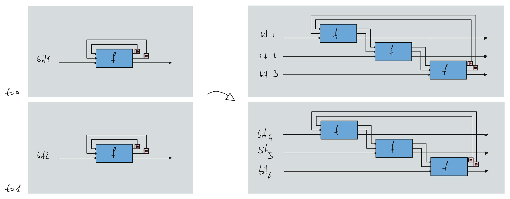
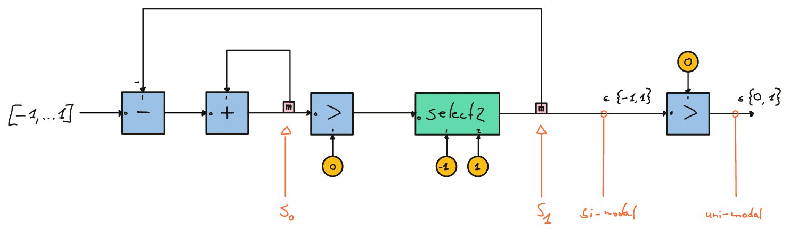
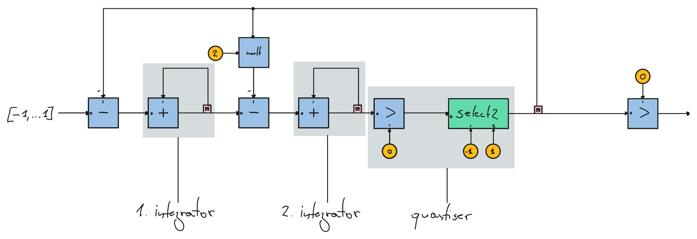
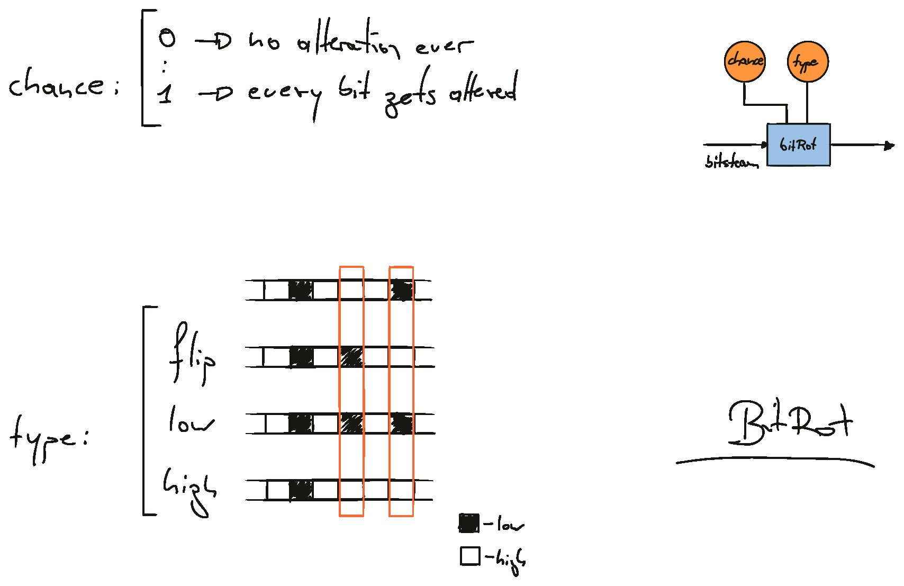
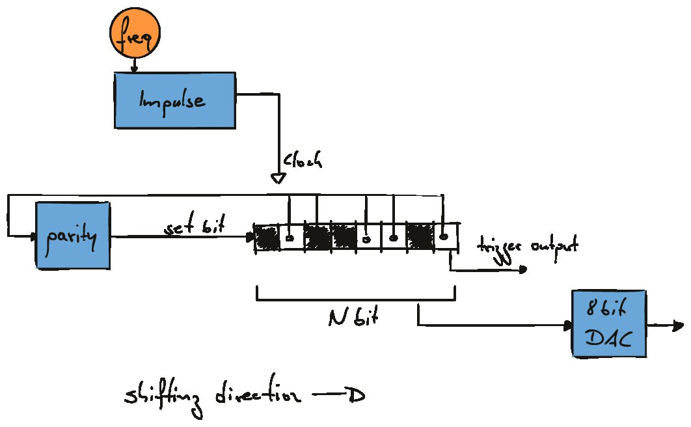
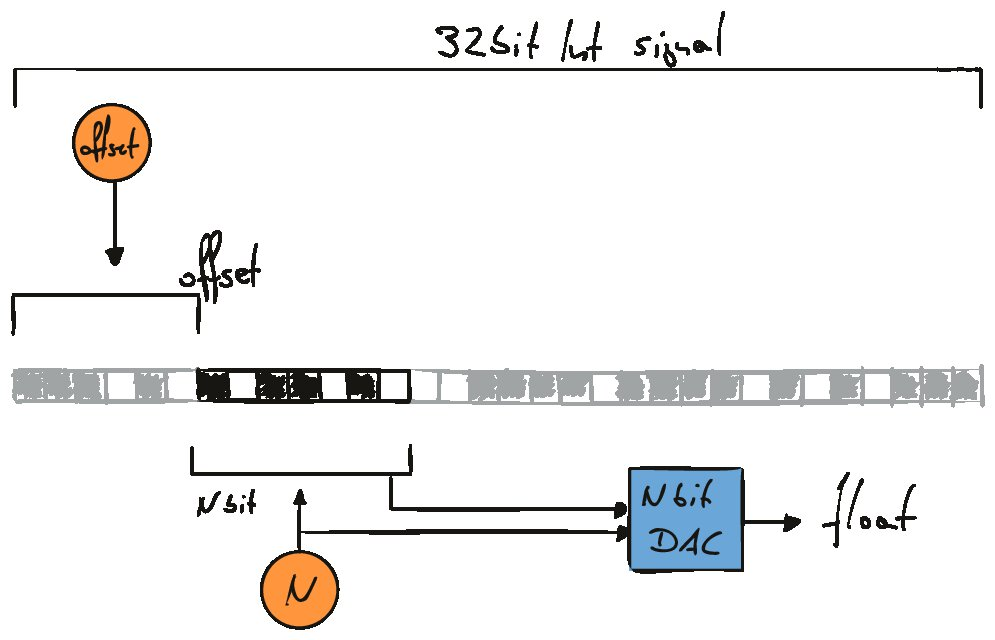
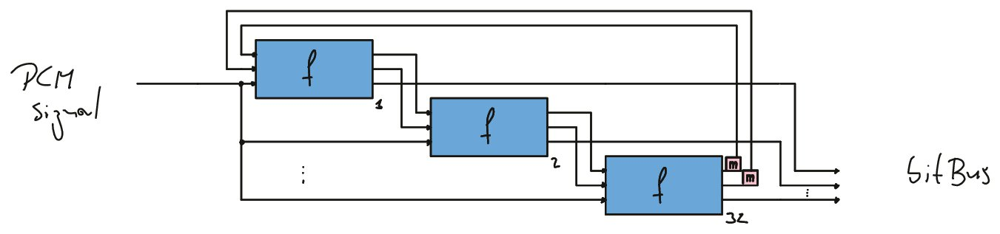

# bitDSP in faust
*[Till Bovermann](http://tai-studio.org) & [Dario Sanfilippo](https://www.dariosanfilippo.com/) for the [rottingsounds project](http://rottingsounds.org)*

BitDSP is a set of [faust](http://faust.grame.fr/) library functions aimed to help explore and research artistic possibilities of bit-based algorithms. 
BitDSP offers three data formats to handle 1-bit data streams:

1. `integer`-based
2. `bitBus<N>`
3. `int32`

BitDSP currently includes implementations of bit-based functions ranging from simple bit operations over classic delta-sigma modulations to more experimental approaches like cellular automata, recursive Boolean networks, and linear feedback shift registers.

A detailed overview of the functionality is in the [paper](https://ifc20.sciencesconf.org/332745/document) "Creative use of bit-stream DSP in faust" presented at [IFC 2020](https://ifc20.sciencesconf.org/).


## data-types

### integer-based

 A straight-forward implementation in which each 1-bit sample is represented as an integer value that is either 0, 1.

This representation allows to implement bit-based operators utilising standard operators. 

For real-time applications, sample rates are, however, limited to the maximum sample-rate supported by the audio interface.

Another limiting factor is that each 1-bit value is represented by (typically) 32 bits, hence computational and memory allocation is far bigger than necessary.

### `bitBus<N>`

(parallel processing of parallel bit-streams) 

The bit-stream is represented by an N-dimensional signal bus of N consecutive samples of the bit-stream in N parallel streams.

This results in an oversampling relative to the sample-rate by a factor of N.

This approach requires unfolding of feedback paths over the N signal buses, which means that standard implementation of the libraries utilising feedback operators cannot be integrated.  Instead, specific versions need to be written.




### `int32`

The bit-stream is encoded in a faust-native integer signal as a sequence of bits that need to be processed in parallel.  For now, an integer in faust typically translates into a 32bit signed integer. Implementations are therefore equivalent to the bitBus bversion with `N=32`. 
The resulting upsampling factor is therefore `N=32`.

Straight-forward operators for the int32 representation are e.g. `bitAnd`, `bitOr` and `bitNot` which is strangely not implemented natively in faust.

Other operators are e.g. left-shift or right-shift for which we also had to rely on external functions because right-shift operators are unfortunately confusingly defined for signed integers in C-like languages.


## Examples

Examples are available in the [examples folder](https://github.com/rottingsounds/bitDSP-faust/tree/master/examples). Each example dsp file has examples on how to compile the dsp file into a running application.

There is also a dedicated SuperCollider examples folder.


## Acknowledgements

This research has been funded through [RottingSounds](http://rottingsounds.org) (project AR 445-G24) by the Austrian Science Fund (FWF).


Subsequent is a list of currently implemented functions (last updated on 2020-12-01).

- [Implemented functionality](#implemented-functionality)
  * [integer-based](#integer-based-1)
    + [`bool_osc0`](#-bool-osc0-)
    + [`bool_osc1`](#-bool-osc1-)
    + [`bool_osc2`](#-bool-osc2-)
    + [`cic`](#-cic-)
    + [`delta`](#-delta-)
    + [`dsm1`](#-dsm1-)
    + [`dsm2`](#-dsm2-)
    + [`full_adder`](#-full-adder-)
    + [`bitstream_adder`](#-bitstream-adder-)
    + [`bitrot`](#-bitrot-)
  * [`bitBus<N>`](#-bitbus-n---1)
    + [`eca`](#-eca-)
    + [`zeropad_up`](#-zeropad-up-)
  * [`int32`](#-int32--1)
    + [`bitNot`](#-bitnot-)
    + [`left_shift`](#-left-shift-)
    + [`right_shift`](#-right-shift-)
    + [`maskedNot`](#-maskednot-)
    + [`maskedAnd`](#-maskedand-)
    + [`maskedOr`](#-maskedor-)
    + [`maskedXor`](#-maskedxor-)
    + [`applyMask`](#-applymask-)
    + [`bit_mask`](#-bit-mask-)
    + [`delay32`](#-delay32-)
    + [`delay`](#-delay-)
    + [`int_min`, `int_max`,](#-int-min----int-max--)
    + [`parity`](#-parity-)
    + [`div`](#-div-)
    + [`lfsr` and `lfsr32`](#-lfsr--and--lfsr32-)
    + [`bitDAC` and `bitDAC_i`](#-bitdac--and--bitdac-i-)
    + [`dsm1` and `dsm1_32`](#-dsm1--and--dsm1-32-)
  * [conversion](#conversion)
    + [`dec2bitBus`](#-dec2bitbus-)
    + [`bitBus_to_int`](#-bitbus-to-int-)
    + [`int32_to_bitBus`](#-int32-to-bitbus-)
    + [`int32_to_bitBus`](#-int32-to-bitbus--1)


## Implemented functionality

### integer-based

All implementations are located in [bitDSP.lib](https://github.com/rottingsounds/bitDSP-faust/blob/master/lib/bitDSP.lib). There you can also find detailed descriptions of their functionality.

To use them in your code, add

```
bit = library("bitDSP.lib");
```

to your `.dsp`-file.

#### `bool_osc0`

Basic Boolean oscillator with four cross-coupled nodes, mainly for chaotic oscillations including limit cycles and strange attractors.

#### `bool_osc1`

Basic Boolean oscillator with two cross-coupled nodes, mainly for chaotic oscillations including limit cycles and strange attractors.

#### `bool_osc2`

Basic Boolean oscillator with two cross-coupled nodes, mainly for chaotic oscillations including limit cycles and strange attractors.

#### `cic`

Comb-integrator circuit lowpass filter based on Eric Lyon's [article](https://www.dsprelated.com/showarticle/1337.php).

#### `delta`

First derivative using linear interpolation delay lines, hence allowing fractional differentiation periods.

#### `dsm1`

First-order digital delta-sigma modulator.




#### `dsm2`

Second-order digital delta-sigma modulator.




#### `full_adder`

Adder for binary values. It adds two operands as well as a carrier input. It outputs the sum as well as the carrier output.

#### `bitstream_adder`

Adder for delta-sigma-modulated streams.

#### `bitrot`

Under a specified likelihood (`noise`, `chance`) and depending on `type`, either 

+ `type == -1` -- set a bit's value to low 
+ `type == 0` -- flip bit
+ `type == 1` -- set a bit's value to high





### `bitBus<N>`

All implementations are located in [bitDSP_bitBus.lib](https://github.com/rottingsounds/bitDSP-faust/blob/master/lib/bitDSP_bitBus.lib). There you can also find detailed descriptions of their functionality.

To use them in your code, add

```
bitBus = library("bitDSP_bitBus");
```

to your `.dsp`-file.


#### `eca`

One-dimension, two-state, elementary cellular automata with circular lattice. The function is defined by the length of the lattice, a rule, and an initial condition. Additionally, the function has a "rate" parameter that determines the interval between iterations. The rule and the initial condition are positive INTs that are converted into binary numbers and accordingly zero-padded or limited to reach a binary string of appropriate length.

#### `zeropad_up`

Add `N` zeros at the beginning of a list.


### `int32`

All implementations are located in [bitDSP_int32.lib](https://github.com/rottingsounds/bitDSP-faust/blob/master/lib/bitDSP_int32.lib). There you can also find detailed descriptions of their functionality.

To use them in your code, add

```
bit32 = library("bitDSP_int32");
```

to your `.dsp`-file.

#### `bitNot`

bitwise Not

*Note: relies on foreign functions (c-based platforms only).*

#### `left_shift`

Unsigned left shift operator.

*Note: relies on foreign functions (c-based platforms only).*


#### `right_shift`

Unsigned right shift operator.

*Note: relies on foreign functions (c-based platforms only).*

#### `maskedNot`

Invert selected bits of an integer.

*Note: relies on foreign functions (c-based platforms only).*


#### `maskedAnd`

 Bit-wise AND of selected bits of two integers. 
 Remaining bits are kept from first parameter.

#### `maskedOr`

 Bit-wise OR of selected bits of two integers. 
 Remaining bits are kept from first parameter.

#### `maskedXor`

Bit-wise XOR of selected bits of two integers. 
Remaining bits are kept from first parameter.

#### `applyMask`

Apply result only to selected bits.

#### `bit_mask`

Create bit mask with indices at list values `== 1`.

*Note: relies on foreign functions (c-based platforms only)*

#### `delay32`

Single-bit delay on an integer bitstream. maximum of 32bit delays possible.

*Note: relies on foreign functions (c-based platforms only).*

#### `delay`

Single-bit delay on integer bitstream.


#### `int_min`, `int_max`, 

Minimum resp. Maximum value of integer datatype.


#### `parity`

Compute parity of a 32bit integer (assuming it to be unsigned)

#### `div`

integer division.

*Note: relies on foreign functions (c-based platforms only).*

#### `lfsr` and `lfsr32`

Compute LFSR on a 32bit resp. `N`-bit integer bitset (assuming it to be unsigned).
Resets on changed input state.
See https://en.wikipedia.org/wiki/Linear-feedback_shift_register for details on LFSRs.

*Note: relies on foreign functions (c-based platforms only).*




#### `bitDAC` and `bitDAC_i`

Select bits of an integer to be interpreted as PCM values.
Range is `[0, 1, .. (2^size)[` resp. `[0.f .. 1]`.

*Note: relies on foreign functions (c-based platforms only).*





#### `dsm1` and `dsm1_32`

Delta-sigma converter for a float-encoded multibit-stream. 
It turns the incoming signal into a binary stream packed into chuncks of a 32.



### conversion

All implementations are located in [bitDSP_conversion.lib](https://github.com/rottingsounds/bitDSP-faust/blob/master/lib/bitDSP_conversion.lib). There you can also find detailed descriptions of their functionality.

To use them in your code, add

```
bitConv = library("bitDSP_conversion");
```

to your `.dsp`-file.

#### `dec2bitBus`

Converts a decimal integer (N) into a Faust list containing the binary digits, that is, the binary digits in parallel.


#### `bitBus_to_int`

turn a stream of parallel binary values into an integer representation by left-shifting (`<<`) the values of the input busses. 


#### `int32_to_bitBus`

Turn a 1bit signal into a stream of parallel binary values

#### `int32_to_bitBus`

turn an integer signal into a stream of parallel binary values
left-shifting (`<<`) the values of the input busses. 
this interprets the input integer as a set of (32) binary values.
alternative implementation to `dec2bitBus`.
